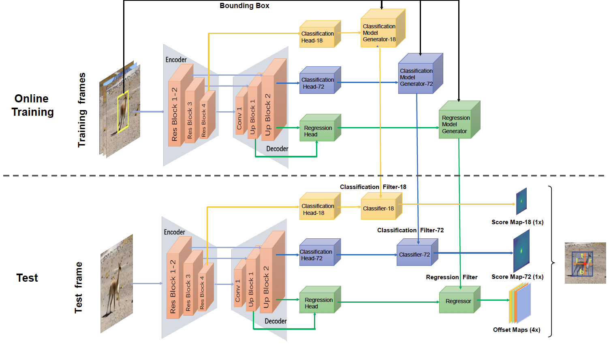

# Fully Convolutional Online Tracking
The official implementation of FCOT using PyTorch. 

[[paper]](https://arxiv.org/abs/2004.07109) 
[[visualization]](https://drive.google.com/drive/folders/1VAvBDRqI4AB9uciwesKt9JDcYPg6ZMVJ?usp=sharing)
[[model]](https://drive.google.com/drive/folders/1-TKOF4sKzUUb6C6XfM-rDjrBoEFhovEf?usp=sharing)
[[raw results]](https://drive.google.com/drive/folders/1OiRNtDHlct_e_SZBYqjrU4VhzFi7Zdoz?usp=sharing)



## News  
* [2020.7.30] Code and model are now released for the tracker FCOT.

## Table of Contents

* [Overview](#overview)
* [Installation](#installation)
* [Training](#training)
* [Test and evaluation](#test-and-evaluation)
* [Results](#results)
* [Acknowledgments](#acknowledgments)
* [Contributors](#Contributors)
* [Citation](#Citation)

## Overview
In this repo, we provide pretrained model, training and inference code for fcot and also the integarated evaluation APIs.
You can easily test trackers on a set of datasets, including **VOT2018**, **TrackingNet**, **GOT-10k**, **LaSOT**, **OTB100**, **UAV123** and **NFS**, 
and use integrated evaluation APIs to evaluate the tracking results (except for **TrackingNet** and **GOT-10k**, which should evaluate on the official server).  


## Installation
Please refer to [INSTALL.md](INSTALL.md) for installation instructions.
We recommend using the [install script](install.sh). Before running the installation script,
make sure you have installed conda with python 3.7 and cuda10.0. And our platform is ubuntu 18.04.
```
./install.sh YOUR_CONDA_INSTALL_PATH ENVIRONMENT_NAME
```

## Training
We use [Lasot](https://cis.temple.edu/lasot/), [GOT-10k](http://got-10k.aitestunion.com), [TrackingNet](https://tracking-net.org) 
and [COCO](http://cocodataset.org/#home) to train fcot. 
Before running the training scripts, you should download the datasets and set the correct datasets path in `ltr/admin/local.py`. 
Also remember to download the pretrained [dimp50](https://drive.google.com/file/d/14zFM14cjJY-D_OFsLDlF1fX5XrSXGBQV/view?usp=sharing) 
model to initialize the backbone and classification-18 branch of fcot. 
Then switch to your conda environment using `conda activate $YOUR_CONDA_ENVIRONMENT`.
The training scripts can be found at [bash](bash) folder. 
 We use the two following stategies to train fcot (we report the results of the first training strategy in the paper).

* 3-stages training: Train the backbone, regression branch (except for reg-optimizer) and classification-72 branch for 70 epochs firstly.
Then freeze the trained modules and train the regression optimizer for 5 epochs. Lastly, train the classification-18 branch for 25 epochs. 
You can use the following commands to train fcot in this strategy. 
```
cd bash
./train_fcot_3stages.sh
```
* 2-stages training: Train the backbone, regression branch (except for reg-optimizer), classification-72 branch and classification-18 branch jointly.
Then freeze that trained modules and train the regression optimizer for 5 epochs.
```
cd bash
./train_fcot_2stages.sh
```
**Note:**   
- You should set the parameters in the scripts. `WORKSPACE_STAGE*` are the path to save the training models and tensorboard information. 
`--devices_id` is the GPUs used to train. `--batch_size` is the total batch size among all the gpus. In our experiments, we use 8 Nvidia 2080Ti gpus 
and set the batch size to 40. More parameters can be set at [ltr/train_settings/fcot/fcot.py](ltr/train_settings/fcot/fcot.py).
The results of the two training strategies are discussed at [Results](#results).

## Test and evaluation
In the pytracking directory, you can test trackers on a set of datasets and use integrated evaluation APIs to evaluate the tracking results. 

**1. Run the tracker on a set of datasets**

In this repo, you can run the tracker on a set of datasets, including **VOT2018**, **GOT-10k**, **TrackingNet**, **LaSOT**, **OTB100**, **UAV123** and **NFS**. Before running the tracking scripts, you should set the correct datasets path in `pytracking/evaluation/local.py`. Then the trained model should be put under `network_path` that you set in local.py. And the file name of the trained models should be set in `params.net` of the inference settings file, which is under the  `parameter/fcot`.  You can use the scripts under `bash` to run fcot on datasets, e.g. `otb` like this:

```
cd bash
./run_fcot_on_otb.sh
```

See scripts under `bin` for the more supported datasets.

**2. Evaluate the tracking results on datasets**

In this repo, we integrate evaluation APIs of Current Single Object *Tracking* Dataset, including **VOT2018**, **LaSOT**, **OTB100**, **UAV123** and **NFS**. Put the tracking results under `results_path/fcot`, where `results_path` is the path you set in local.py. You can use the scripts under `bash` to evaluate results of datasets, e.g. `otb` like this:

```
cd bash
./eval_fcot_on_otb.sh
```

See scripts under `bin` for the more scripts to evaluate on other datasets.

For **GOT-10k**, **TrackingNet**, you need to evaluate results on official server, we provide tools to pack tracking results into the zipfile of submission format. Also, put the tracking results under `results_path/fcot`, you can use the script to pack trackingnet results:

```
cd bash
./pack_fcot_results_on_tn.sh
```

The packed zipfile can be found in the path `packed_results_path` that you set in local.py.

## Results
The raw experimental results reported in paper on **VOT2018**, **GOT-10k**, **TrackingNet**, **LaSOT**, **OTB100**, **UAV123** and **NFS** benchmarks can be found at 
[Google Drive](https://drive.google.com/drive/folders/1OiRNtDHlct_e_SZBYqjrU4VhzFi7Zdoz?usp=sharing)
 or [Baidu Drive](https://pan.baidu.com/s/1fvH28BunWTvkCrnagR4GaA) (extraction code:4vtg).
 The evaluation results of the models trained with the released code are as follows. FCOT-2s and FCOT-3s are trained with
 the two training strategies as described in [Training](#training) and based on the released code. 
 The results in the first line is the original ones in the paper and the model is trained with our old messy code using the first strategy.
 FCOT can achieve an speed of 47 fps on GOT-10k dataset using Nvidia GTX 2080Ti. (And the corresponding tracking speed is around 44 fps on Nvidia GTX 1080Ti.)

<table>
  <tr>
    <th>Model</th>
    <th>VOT18<br>EAO/ROB</th>
    <th>OTB100<br>AUC/PREC</th>
    <th>NFS<br>AUC</th>
    <th>UAV123<br>AUC</th>
    <th>LaSOT<br>AUC/NP</th>
    <th>TN<br>AUC</th>
    <th>GOT-10k<br>AO</th>
  </tr>
  <tr>
    <td>DiMP-50</td>
    <td>0.440/0.153</td>
    <td>68.4/0.894</td>
    <td>61.9</td>
    <td>64.3</td>
    <td>56.9/65.0</td>
    <td>74.0</td>
    <td>61.1</td>
  </tr>
  <tr>
    <td>Original</td>
    <td>0.508/0.108</td>
    <td>69.3/91.3</td>
    <td>63.2</td>
    <td>65.4</td>
    <td>56.9/67.8</td>
    <td>75.1</td>
    <td>64.0</td>
  </tr>
  <tr>
    <td>FCOT-3s (new)</td>
    <td>0.501/0.098</td>
    <td>70.2/92.5</td>
    <td>63.4</td>
    <td>65.3</td>
    <td>56.7/67.3</td>
    <td>75.0</td>
    <td>-</td>
  </tr>
  <tr>
    <td>FCOT-2s (new)</td>
    <td>0.461/0.126</td>
    <td>-</td>
    <td>-</td>
    <td>-</td>
    <td>57.7/68.5</td>
    <td>75.3</td>
    <td>-</td>
  </tr>

</table>


## Acknowledgments

* [pytracking](https://github.com/visionml/pytracking) - The implementation of FCOT training and tracking is based on this framework. 
* [pysot](https://github.com/STVIR/pysot) - The tools to run trackers on VOT2018
* [pysot-toolkit](https://github.com/StrangerZhang/pysot-toolkit) - Evaluation APIs of Current Single Object *Tracking* Dataset

## Contributors

* [Yutao Cui](https://github.com/yutaocui)  
* [Cheng Jiang](https://github.com/jcaha)

## Citation
Please consider citing our paper in your publications if the project helps your research.
```bibtex
@InProceedings{fcot2020,
    title={Fully Convolutional Online Tracking},
    author={Yutao Cui and Cheng Jiang and Limin Wang and Gangshan Wu},
    booktitle={arXiv preprint arXiv:2004.07109},
    year={2020}
}
```
